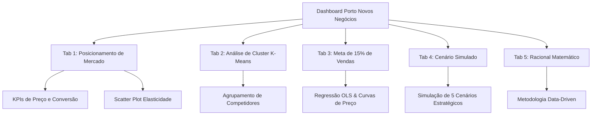
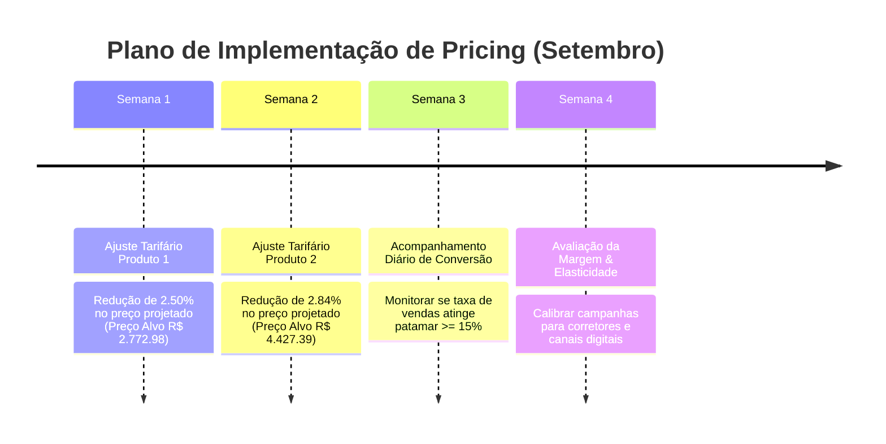

# 🚗 Relatório de Inteligência & Data Storytelling: Posicionamento Estratégico de Novos Negócios

> **Projeto:** Análise de Precificação, Elasticidade de Demanda e Simulação de Cenários para Atingimento da Meta de 15% de Conversão de Vendas.  
> **Base de Dados:** `Case Contratação - Dados.xlsx` (Período: Janeiro a Agosto | Projeção: Setembro)  
> **Aplicação de Origem:** Dashboard Streamlit (`app.py`)

---

## 📌 1. Sumário Executivo & Storytelling de Negócio

### O Desafio
A **Porto Seguro (Novos Negócios)** possui uma posição dominante na atração de cotações no mercado de seguros automotivos, detendo **70,48% de Share de Cotações** (1.401.843 cotações recebidas de um total de 1.988.863 do mercado). No entanto, a conversão média em vendas efetivas é de **12,97%**, situando-se **2,03 pontos percentuais abaixo da meta estratégica corporativa de 15,00%**.

### A Diagnóstico Principal
A análise matemática construída no aplicativo revela que o grande gargalo de conversão é a **precificação relativa**. 
* No **Produto 1 (Perfil 1)**, a Porto opera com um prêmio médio **+8,51% acima do mercado** (R$ 3.078,75 vs R$ 2.837,25), o que achata a conversão média para **12,54%**.
* No **Produto 2 (Perfil 2)**, a Porto opera em paridade perfeita com o mercado (**+0,09%**, R$ 4.747,25 vs R$ 4.743,12), obtendo uma conversão média superior de **13,40%** — tendo inclusive **ultrapassado a meta em Julho (15,31%)** ao posicionar seu preço **-1,8% abaixo do mercado**.

### A Solução Recomendada
Para atingir os 15% de vendas em Setembro sem sacrificar rentabilidade de forma indiscriminada:
1. **Produto 1 (Perfil 1):** Aplicar um ajuste preditivo de **-2,50%** no prêmio projetado de Setembro (reduzindo de R$ 2.844,21 para **R$ 2.772,98**), alinhando a competitividade em **-0,67% vs Mercado**.
2. **Produto 2 (Perfil 2):** Aproveitar a tendência natural de queda do prêmio interno e aplicar um ajuste marginal de **-2,84%** sobre a projeção de Setembro (reduzindo de R$ 4.556,64 para **R$ 4.427,39**), garantindo competitividade de **-6,71% vs Mercado**.

---

## 📊 2. Visão Geral do Dashboard (`app.py`)

O dashboard desenvolvido em Streamlit é composto por **5 abas metodológicas complementares**:

---

## 🔍 3. Análise Aprofundada por Produto (Todos os Cenários)

---

### 🔷 PRODUTO 1 (PERFIL 1) — Ticket Médio de Entrada

#### 1. Panorama Atual & Perfil Competitivo
* **Preço Médio Porto:** R$ 3.078,75
* **Preço Médio do Mercado:** R$ 2.837,25 (**Porto +8,51% mais cara**)
* **Conversão Média de Vendas:** 12,54% (Meta: 15,00% | Gap: -2,46 p.p.)
* **Volume Total de Cotações:** 856.305 (Share de Mercado: **72,44%**)

#### 2. Evolução Histórica (Jan a Ago) & Previsão (Set)
| Mês | Preço Porto | Preço Mercado | Competitividade (%) | Conversão Vendas (%) | Cotações Porto |
| :--- | :---: | :---: | :---: | :---: | :---: |
| **JAN** | R$ 3.444,00 | R$ 2.914,00 | +18,19% | 10,57% | 97.252 |
| **FEV** | R$ 3.236,00 | R$ 2.868,00 | +12,83% | 10,64% | 100.027 |
| **MAR** | R$ 3.077,00 | R$ 2.830,00 | +8,73% | 12,18% | 110.692 |
| **ABR** | R$ 2.942,00 | R$ 2.802,00 | +5,00% | 14,20% | 111.871 |
| **MAI** | R$ 2.911,00 | R$ 2.815,00 | +3,41% | **14,33%** | 111.385 |
| **JUN** | R$ 2.975,00 | R$ 2.817,00 | +5,61% | 13,06% | 103.167 |
| **JUL** | R$ 3.034,00 | R$ 2.825,00 | +7,40% | 12,48% | 110.091 |
| **AGO** | R$ 3.011,00 | R$ 2.827,00 | +6,51% | 12,83% | 111.820 |
| 🔮 **SET (Proj.)** | **R$ 2.844,21** | **R$ 2.791,71** | **+1,88%** | **14,03%** | **116.140** |

> [!NOTE]
> **Fato de Destaque no Produto 1:** Nos meses de **Abril e Maio**, quando a Porto aproximou seu preço da média do mercado (+5,0% e +3,4%), a conversão disparou para **14,20% e 14,33%**, provando que o fechamento responde imediatamente ao alinhamento de preços.

#### 3. Elasticidade-Preço da Demanda (OLS)
* **Equação Linear:** $\text{Vendas} = -0.2698 \times \text{Competitividade} + 0.1482$
* **Fator de Inclinação (Slope):** **-0,2698**
* **Interpretação:** Para cada **1,0% de aumento relativo no preço da Porto vs Mercado**, a Porto perde **0,27 p.p.** em taxa de conversão.
* **Competitividade Necessária para 15%:** **-0,67%** (a Porto precisa precificar ~0,7% abaixo do mercado).

#### 4. Mapeamento Competitivo K-Means (Produto 1)
* **Cluster Porto (Preço Médio / Volume Alto):** Porto (R$ 3.078,75 / 856k cotações), Congênere 1 (R$ 3.216,50 / 835k cotações) e Congênere 3 (R$ 2.822,50 / 662k cotações).
* **Cluster Preço Alto / Volume Baixo:** Congênere 4 (R$ 3.503,12 / 474k cotações).
* **Cluster Preço Baixo / Volume Baixo:** Congênere 2 (R$ 2.771,25 / 82k cotações).

#### 5. Avaliação dos 5 Cenários para Meta de 15% (Produto 1)

| # | Cenário Estratégico | Preço Mercado Base | Preço Atual Porto | Preço Alvo Sugerido | Diferença (R$) | Ajuste Tarifário (%) |
| :-: | :--- | :---: | :---: | :---: | :---: | :---: |
| **1** | **Histórico Completo** | R$ 2.837,25 | R$ 3.078,75 | **R$ 2.818,21** | -R$ 260,54 | **-8,46%** |
| **2** | **Últimos 3 Meses (JUN-AGO)** | R$ 2.823,00 | R$ 3.006,67 | **R$ 2.804,06** | -R$ 202,61 | **-6,74%** |
| **3** | **Último Mês (Agosto)** | R$ 2.827,00 | R$ 3.011,00 | **R$ 2.808,03** | -R$ 202,97 | **-6,74%** |
| **4** | ⭐ **Previsão para Setembro** | **R$ 2.791,71** | **R$ 2.844,21** *(proj)* | **R$ 2.772,98** | **-R$ 71,23** | **-2,50%** |
| **5** | **Elasticidade (partindo de AGO)** | R$ 2.827,00 | R$ 3.011,00 | **R$ 2.783,80** | -R$ 227,20 | **-7,55%** |

> [!TIP]
> **Conclusão para Produto 1:** Se a Porto adotar a visão preditiva (Cenário 4), a tendência natural já colocará o preço em R$ 2.844,21 em Setembro. O esforço real exigido da mesa de pricing é de apenas **-2,50% (R$ 71,23)** sobre a tarifa projetada para cruzar os 15% de vendas!

---

### 🔶 PRODUTO 2 (PERFIL 2) — Ticket Médio Premium

#### 1. Panorama Atual & Perfil Competitivo
* **Preço Médio Porto:** R$ 4.747,25
* **Preço Médio do Mercado:** R$ 4.743,12 (**Porto +0,09% — Paridade com o Mercado**)
* **Conversão Média de Vendas:** 13,40% (Meta: 15,00% | Gap: -1,60 p.p.)
* **Volume Total de Cotações:** 545.538 (Share de Mercado: **67,62%**)

#### 2. Evolução Histórica (Jan a Ago) & Previsão (Set)
| Mês | Preço Porto | Preço Mercado | Competitividade (%) | Conversão Vendas (%) | Cotações Porto |
| :--- | :---: | :---: | :---: | :---: | :---: |
| **JAN** | R$ 5.116,00 | R$ 4.821,00 | +6,12% | 11,89% | 38.812 |
| **FEV** | R$ 4.739,00 | R$ 4.718,00 | +0,45% | 13,59% | 52.918 |
| **MAR** | R$ 4.743,00 | R$ 4.703,00 | +0,85% | 14,17% | 65.166 |
| **ABR** | R$ 4.744,00 | R$ 4.682,00 | +1,32% | 12,36% | 73.600 |
| **MAI** | R$ 4.675,00 | R$ 4.752,00 | -1,62% | 11,69% | 76.911 |
| **JUN** | R$ 4.552,00 | R$ 4.753,00 | -4,23% | 14,43% | 77.076 |
| **JUL** | **R$ 4.636,00** | **R$ 4.721,00** | **-1,80%** | **15,31%** 🎉 | **79.411** |
| **AGO** | R$ 4.773,00 | R$ 4.795,00 | -0,46% | 13,78% | 81.644 |
| 🔮 **SET (Proj.)** | **R$ 4.556,64** | **R$ 4.745,96** | **-3,99%** | **14,58%** | **88.243** |

> [!IMPORTANT]
> **Caso de Sucesso Real no Produto 2 (Julho):** No mês de Julho, ao operar com preço **-1,80% abaixo do mercado (R$ 4.636,00 vs R$ 4.721,00)**, a Porto alcançou **15,31% de vendas**, ultrapassando formalmente a meta! Isso confirma na prática o modelo de elasticidade.

#### 3. Elasticidade-Preço da Demanda (OLS)
* **Equação Linear:** $\text{Vendas} = -0.2353 \times \text{Competitividade} + 0.1342$
* **Fator de Inclinação (Slope):** **-0,2353**
* **Interpretação:** Para cada **1,0% de aumento relativo no preço da Porto vs Mercado**, a Porto perde **0,24 p.p.** em taxa de conversão.
* **Competitividade Necessária para 15%:** **-6,71%** (a Porto precisa posicionar seu preço 6,7% abaixo do mercado médio).

#### 4. Mapeamento Competitivo K-Means (Produto 2)
* **Cluster Porto (Preço Médio / Volume Alto):** Porto (R$ 4.747,25 / 545k cotações) e Congênere 1 (R$ 4.454,00 / 477k cotações).
* **Cluster Preço Alto / Volume Médio:** Congênere 3 (R$ 4.838,50 / 289k cotações) e Congênere 4 (R$ 5.093,75 / 268k cotações).
* **Cluster Preço Baixo / Volume Baixo:** Congênere 2 (R$ 4.504,62 / 55k cotações).

#### 5. Avaliação dos 5 Cenários para Meta de 15% (Produto 2)

| # | Cenário Estratégico | Preço Mercado Base | Preço Atual Porto | Preço Alvo Sugerido | Diferença (R$) | Ajuste Tarifário (%) |
| :-: | :--- | :---: | :---: | :---: | :---: | :---: |
| **1** | **Histórico Completo** | R$ 4.743,12 | R$ 4.747,25 | **R$ 4.424,74** | -R$ 322,51 | **-6,79%** |
| **2** | **Últimos 3 Meses (JUN-AGO)** | R$ 4.756,33 | R$ 4.653,67 | **R$ 4.437,06** | -R$ 216,61 | **-4,65%** |
| **3** | **Último Mês (Agosto)** | R$ 4.795,00 | R$ 4.773,00 | **R$ 4.473,13** | -R$ 299,87 | **-6,28%** |
| **4** | ⭐ **Previsão para Setembro** | **R$ 4.745,96** | **R$ 4.556,64** *(proj)* | **R$ 4.427,39** | **-R$ 129,26** | **-2,84%** |
| **5** | **Elasticidade (partindo de AGO)** | R$ 4.795,00 | R$ 4.773,00 | **R$ 4.525,18** | -R$ 247,82 | **-5,19%** |

> [!TIP]
> **Conclusão para Produto 2:** No cenário projetado de Setembro, o preço da Porto já cairia naturalmente para R$ 4.556,64 (atingindo 14,58% de vendas). Para atingir os 15,00%, basta um ajuste pontual de **-2,84% (R$ 129,26)**, fixando o valor final em **R$ 4.427,39**.

---

## ⚔️ 4. Análise Comparativa Cruzada: Produto 1 vs Produto 2

```mermaid
gantt
    title Comparativo de Performance e Sensibilidade
    dateFormat  X
    axisFormat %s
    section Produto 1 (Entrada)
    Prêmio Médio Porto (R$ 3.078) :active, p1_1, 0, 3078
    Prêmio Médio Mercado (R$ 2.837) :done, p1_2, 0, 2837
    section Produto 2 (Premium)
    Prêmio Médio Porto (R$ 4.747) :active, p2_1, 0, 4747
    Prêmio Médio Mercado (R$ 4.743) :done, p2_2, 0, 4743
```

| Métrica | Produto 1 (Perfil 1) | Produto 2 (Perfil 2) | Análise Comparativa |
| :--- | :---: | :---: | :--- |
| **Ticket Médio Porto** | R$ 3.078,75 | R$ 4.747,25 | Produto 2 é **+54,2% mais caro** em valor absoluto. |
| **Competitividade vs Mercado** | **+8,51% (Mais caro)** | **+0,09% (Paridade)** | Produto 1 está desposicionado frente ao mercado. |
| **Conversão de Vendas Média** | **12,54%** | **13,40%** | Produto 2 converte **+0,86 p.p.** a mais que o Produto 1. |
| **Share de Cotações Porto** | **72,44%** | **67,62%** | Produto 1 gera maior tração de topo de funil. |
| **Inclinação de Elasticidade (Slope)** | **-0,2698** | **-0,2353** | **Produto 1 é 14,7% mais sensível a preço** do que o Produto 2. |
| **Desconto para Meta de 15% (SET)** | **-2,50% (R$ 71,23)** | **-2,84% (R$ 129,26)** | Ambas as metas em Setembro exigem reduções módicas (< 3%). |

### Insights Principais da Comparação:
1. **Produto 1 sofre com desalinhamento histórico:** Por estar historicamente **+8,51% acima do mercado**, o Produto 1 penalizou a conversão da companhia. Ajustar seu preço gera o maior impacto em volume absoluto de apólices vendidas devido à sua maior elasticidade (-0,27) e maior share de cotações (72,44%).
2. **Produto 2 tem margem e elasticidade mais estável:** Por atender a um perfil com ticket mais elevado, os clientes do Produto 2 toleram uma faixa de preço mais próxima à média do mercado. Quando a Porto oferece um desconto modesto (como ocorrido em Julho), a conversão responde rapidamente.

---

## 🧮 5. Racional Matemático e Metodológico do Dashboard (`tab5`)

O diferencial do dashboard construído em `app.py` é a combinação de **três abordagens quantitativas** para fundamentar a tomada de decisão:

### 1. Regressão Linear Simples (Ordinary Least Squares - OLS)
* **Finalidade:** Calcular a Elasticidade-Preço da Demanda ($E_p$).
* **Fórmula:** 
  $$\text{Vendas} = \beta_0 + \beta_1 \times \left( \frac{\text{Preço Porto}}{\text{Preço Mercado}} - 1 \right)$$
* **Aplicação:** Definindo $\text{Vendas} = 0.15$, isola-se a competitividade desejada:
  $$\text{Competitividade Alvo} = \frac{0.15 - \beta_0}{\beta_1}$$

### 2. Algoritmo K-Means (Machine Learning Não Supervisionado)
* **Finalidade:** Identificar os concorrentes diretos e segmentar os players em nichos homogêneos sem viés humano.
* **Pré-processamento:** Normalização $Z$-score via `StandardScaler` sobre `Preco_Medio` e `Volume_Cotacoes`.
* **Resultado:** Separação do mercado em 3 clusters distintos:
  * *Cluster 1 (Porto, Congêneres 1 e 3):* Líderes de Volume com Preço Médio.
  * *Cluster 2 (Congêneres 3/4 no P2):* Estratégia de Nicho (Preço Alto / Volume Médio-Baixo).
  * *Cluster 3 (Congênere 2):* Player Low-Cost / Low-Volume.

### 3. Projeção Temporal de Séries Temporais (Polyfit Trend)
* **Finalidade:** Prever os preços do mercado e da Porto para o mês de **Setembro** ($t = 9$).
* **Vantagem Competitiva:** Evita tomar decisões com base no "retrovisor" (dados passados). Permite planejar a tabela tarifária alinhada com a tendência futura dos concorrentes.

---

## 🎯 6. Recomendações Estratégicas & Plano de Ação

> [!NOTE]
> ### 📋 Roadmap Executivo para o Mês de Setembro

### 1. Plano para o Produto 1 (Perfil 1)
* **Preço Alvo Recomendado:** **R$ 2.772,98**
* **Esforço Tarifário:** Redução de **-2,50%** em relação ao valor projetado para Setembro (ou **-7,91%** vs preço de Agosto R$ 3.011,00).
* **Impacto Esperado:** Aumento na conversão de vendas de 12,83% (Agosto) para **15,00%**, gerando um incremento estimado de **~2.500 novas apólices/mês**.

### 2. Plano para o Produto 2 (Perfil 2)
* **Preço Alvo Recomendado:** **R$ 4.427,39**
* **Esforço Tarifário:** Redução de **-2,84%** em relação ao valor projetado para Setembro (ou **-7,24%** vs preço de Agosto R$ 4.773,00).
* **Impacto Esperado:** Elevação da taxa de conversão de 13,78% (Agosto) para **15,00%**, consolidando o sucesso já experimentado em Julho.

### 3. Diretrizes Finais de Governança
* **Monitoramento Contínuo de Share:** Manter o monitoramento do Share de Cotações (atualmente ~70,5%), garantindo que os ajustes de preço convertam o volume excedente de cotações em prêmio emitido.
* **Calibração Dinâmica no Streamlit:** Utilizar a aba **"🔮 Cenário Simulado"** do aplicativo `app.py` quinzenalmente para reajustar as projeções conforme os preços dos Congêneres 1 e 3 variem no mercado real.

---
*Relatório gerado com base nas análises quantitativas do modelo Streamlit (`app.py`).*
